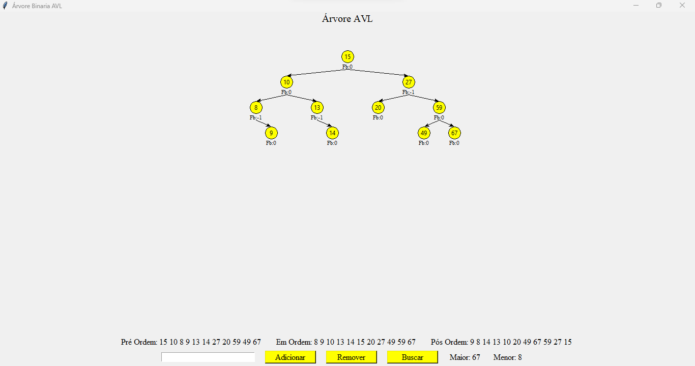

# Estrutura de dados

Fila

<blockquote> Interface ainda não foi implementada </blockquote>

Pilha

<blockquote>Interface ainda não foi implementada.</blockquote>

Lista encadeada

<blockquote>Interface ainda não foi implementada.</blockquote>

Lista duplamente encadeada

<blockquote>Interface ainda não foi implementada.</blockquote>

Lista encadeada circular

<blockquote>Interface ainda não foi implementada.</blockquote>

  
Árvore AVL

  <blockquote>Prt Sc da execução da árvore AVL usando a biblioteca do python(Tkinter).</blockquote>
  <blockquote></blockquote>

